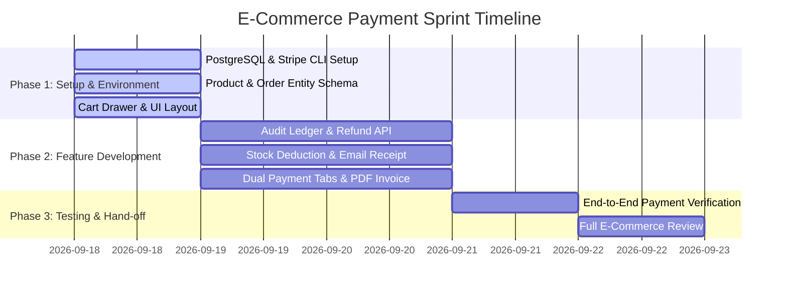

# 📋 Team Project Plan & Task Division (3 Persons)

This document outlines the collaborative engineering plan, role distribution, remaining development tasks, Git workflow, and milestone tracking for the **Spring Boot Stripe Payment Integration** project.

---

## 🏗️ Architecture & Collaboration Overview

```text
                      ┌────────────────────────────────────────┐
                      │          E-COMMERCE PAYMENT APP        │
                      └───────────────────┬────────────────────┘
                                          │
        ┌─────────────────────────────────┼────────────────────────────────┐
        │                                 │                                │
        ▼                                 ▼                                ▼
┌──────────────┐                  ┌──────────────┐                 ┌──────────────┐
│   PERSON 1   │                  │   PERSON 2   │                 │   PERSON 3   │
│ DB & GATEWAY │                  │ API & LOGIC  │                 │   UI & UX    │
└──────────────┘                  └──────────────┘                 └──────────────┘
```

> [!NOTE]
> **Starter Foundation Status:**
> The repository comes with a working compile-ready baseline (`mvnw` wrapper, port `3000`, PostgreSQL configuration template `application.properties.example`, and baseline entity/service/UI skeletons).
> The tasks listed below represent the **active remaining features** each person must implement and test for the final deliverable.

---

## 👤 Person 1: Database & Payment Gateway Specialist

**Domain:** Persistence Layer, Stripe Java SDK, Webhooks, and Audit Logging.

### Person 1 Remaining Tasks

- [ ] **Task 1.1: Environment & Real Stripe Test Keys Setup**
  - Copy `src/main/resources/application.properties.example` to `application.properties` (ignored by git).
  - Register a free Stripe account at [dashboard.stripe.com](https://dashboard.stripe.com/test/apikeys) and obtain real `pk_test_...` and `sk_test_...` keys.
  - Verify PostgreSQL connection to local database `stripepayment_ec` on port `5432`.

- [ ] **Task 1.2: Local Webhook Listener with Stripe CLI**
  - Download and run the Stripe CLI tool.
  - Forward live webhook events to local Spring Boot:

    ```bash
    stripe listen --forward-to localhost:3000/api/v1/payments/stripe/webhook
    ```

  - Copy the signing secret (`whsec_...`) into `application.properties`.

- [ ] **Task 1.3: Payment Transaction Audit Ledger (`PaymentTransaction` Entity)**
  - Create a dedicated audit entity `PaymentTransaction.java` with table `payment_transactions`.
  - Record each transaction attempt: `transactionId`, `paymentOrderId`, `stripeChargeId`, `paymentMethod` (e.g. Visa/Mastercard), `cardLast4`, `cardBrand`, `failureCode`, and `rawEventPayload`.
  - Create `PaymentTransactionRepository.java` to query transaction history by order reference.

- [ ] **Task 1.4: Stripe Refund Integration**
  - Implement refund method in `StripeService.java` using `com.stripe.model.Refund.create()`.
  - Support both full and partial refunds given a `paymentIntentId` or `chargeId`.
  - Update `PaymentOrder` status to `REFUNDED` upon successful refund event.

- [ ] **Task 1.5: Currency Converter (USD / KHR)**
  - Build a conversion helper to calculate Khmer Riel (KHR) amounts into USD (e.g. standard rate `1 USD = 4,100 KHR`).
  - Ensure Stripe line items always settle in USD cents for Cambodian bank card transactions.

---

## 👤 Person 2: Business Logic & REST API Architect

**Domain:** E-Commerce Catalog, Order Lifecycle, Stock Deduction, and Automated Notifications.

### Person 2 Remaining Tasks

- [ ] **Task 2.1: E-Commerce Product & Order Items Modeling**
  - Implement `Product.java` entity (fields: `id`, `name`, `sku`, `price`, `stockQuantity`, `imageUrl`, `description`).
  - Implement `OrderItem.java` entity linking `PaymentOrder` with multiple `Product` items and quantities.
  - Create repositories: `ProductRepository.java` and `OrderItemRepository.java`.

- [ ] **Task 2.2: Inventory Stock Reduction & Validation Logic**
  - Before initiating Stripe Checkout, verify that requested product quantities are in stock.
  - Automatically decrement stock in PostgreSQL when order transitions to `COMPLETED`.
  - Handle rollback/replenishment if payment fails or is cancelled.

- [ ] **Task 2.3: Automated Email Invoice Service**
  - Add `spring-boot-starter-mail` dependency to `pom.xml`.
  - Implement `EmailService.java` to send HTML receipts to `customerEmail` when Stripe confirms payment.
  - Include order reference, itemized breakdown, amount paid in USD, and store support contact.

- [ ] **Task 2.4: Payment Gateway Strategy Pattern (Future KHQR Readiness)**
  - Refactor payment processing into a generic interface `PaymentGateway`:

    ```java
    public interface PaymentGateway {
        PaymentResponseDto initiatePayment(PaymentOrder order);
        void verifyPayment(String transactionRef);
    }
    ```

  - Implement `StripePaymentGateway` as the default provider.
  - Prepare skeleton `AbaPayWayGateway` for future domestic KHQR integration.

- [ ] **Task 2.5: Automated JUnit & Mockito Test Suite**
  - Write unit tests for `PaymentOrderServiceTest` mocking Stripe session creation.
  - Write API integration tests for `PaymentApiControllerTest` verifying validation on invalid emails or negative amounts.

---

## 👤 Person 3: Frontend & User Experience (UX/UI) Developer

**Domain:** Product Showcase, Shopping Cart Drawer, Payment Portal, and Receipt Generation.

### Person 3 Remaining Tasks

- [ ] **Task 3.1: Product Showcase Grid & Cart Drawer UI**
  - Build an interactive catalog page showing book/item cards with image, price in USD, and "Add to Cart" button.
  - Build a sliding cart drawer displaying added items, quantity increment/decrement controls, subtotal calculation, and "Proceed to Checkout" button.

- [ ] **Task 3.2: Dual Payment Method Selector UI**
  - Update checkout interface with tabbed payment method selection:
    - 💳 **Tab 1: Credit/Debit Card (Visa / Mastercard via Stripe)**
    - 📱 **Tab 2: KHQR (Bakong / ABA)** — renders a simulated KHQR popup modal explaining domestic banking app scanning.

- [ ] **Task 3.3: Live Currency Switcher (USD / KHR)**
  - Add a navbar toggle between `$ USD` and `៛ KHR`.
  - Dynamically recalculate and display prices in Khmer Riel using standard exchange rate (`1 USD = 4,100 KHR`).

- [ ] **Task 3.4: Downloadable PDF Invoice on Success Page**
  - Add a **Download PDF Receipt** button on `success.html`.
  - Use `html2pdf.js` or dedicated CSS `@media print` layout with merchant header, item table, and transaction verification code.

- [ ] **Task 3.5: Customer Order History Page (`orders.html`)**
  - Build an order lookup page where customers enter their email or order reference.
  - Fetch and display past orders, payment statuses (`COMPLETED`, `PENDING`, `CANCELLED`), and downloadable receipts.

---

## 🔄 Git Branching & Collaboration Strategy

```text
main (Production / Protected Release)
 └── develop (Integration Branch - Collaborators push here)
      ├── feature/p1-stripe-audit-refund  (Person 1)
      ├── feature/p2-cart-stock-email     (Person 2)
      └── feature/p3-catalog-cart-receipt (Person 3)
```

### Git Workflow Steps

1. **Clone repository and checkout `develop`:**

   ```bash
   git clone <repository_url>
   git checkout develop
   git checkout -b feature/<your-feature-name> develop
   ```

2. **Configure your local properties:**

   ```bash
   # Copy template to real properties
   cp src/main/resources/application.properties.example src/main/resources/application.properties
   ```

3. **Commit with descriptive conventional commits:**

   ```bash
   git commit -m "feat(p1): add PaymentTransaction ledger table and repository"
   git commit -m "feat(p2): implement Product entity and stock deduction logic"
   git commit -m "feat(p3): add product catalog grid and cart sliding drawer"
   ```

4. **Pull request to `develop`:**
   - Push your feature branch and open a PR into `develop`.
   - Once all tasks pass testing on `develop`, merge `develop` into `main`.
   - Have at least one teammate review the PR before merging.

---

## 🎯 Project Milestones & Timeline


